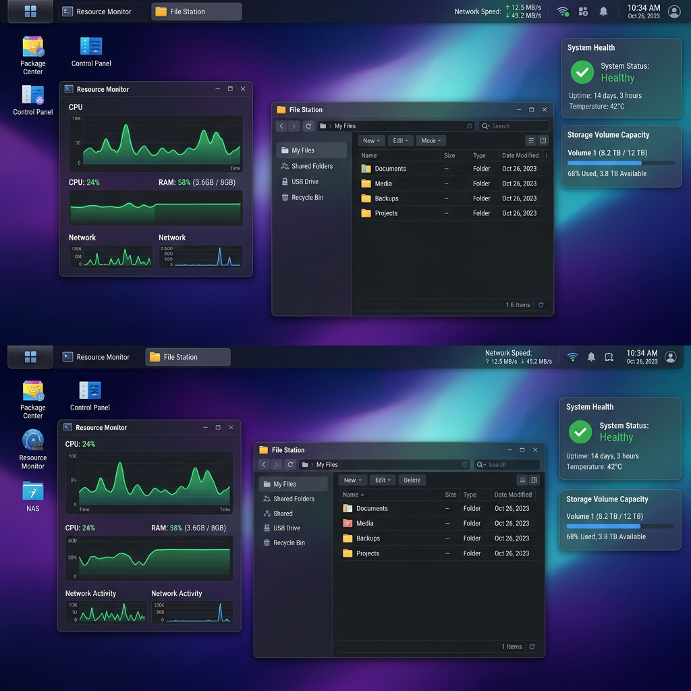
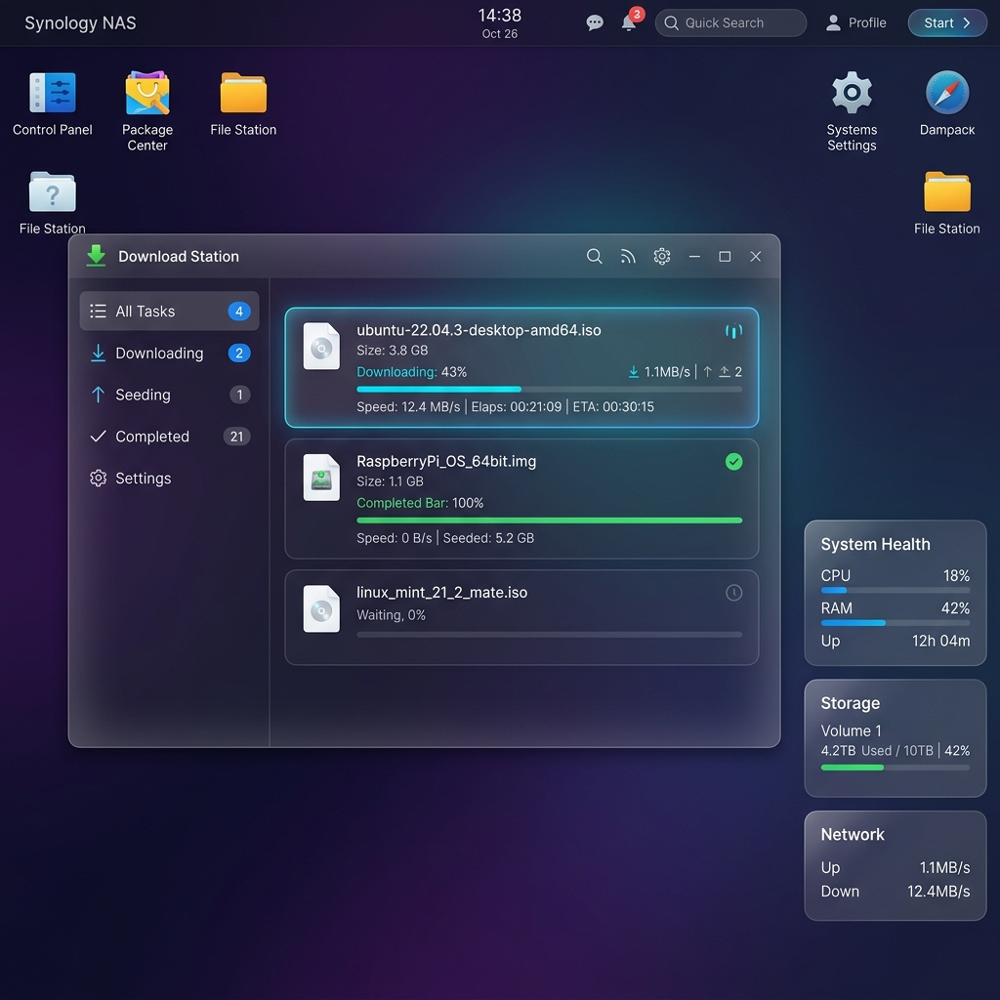
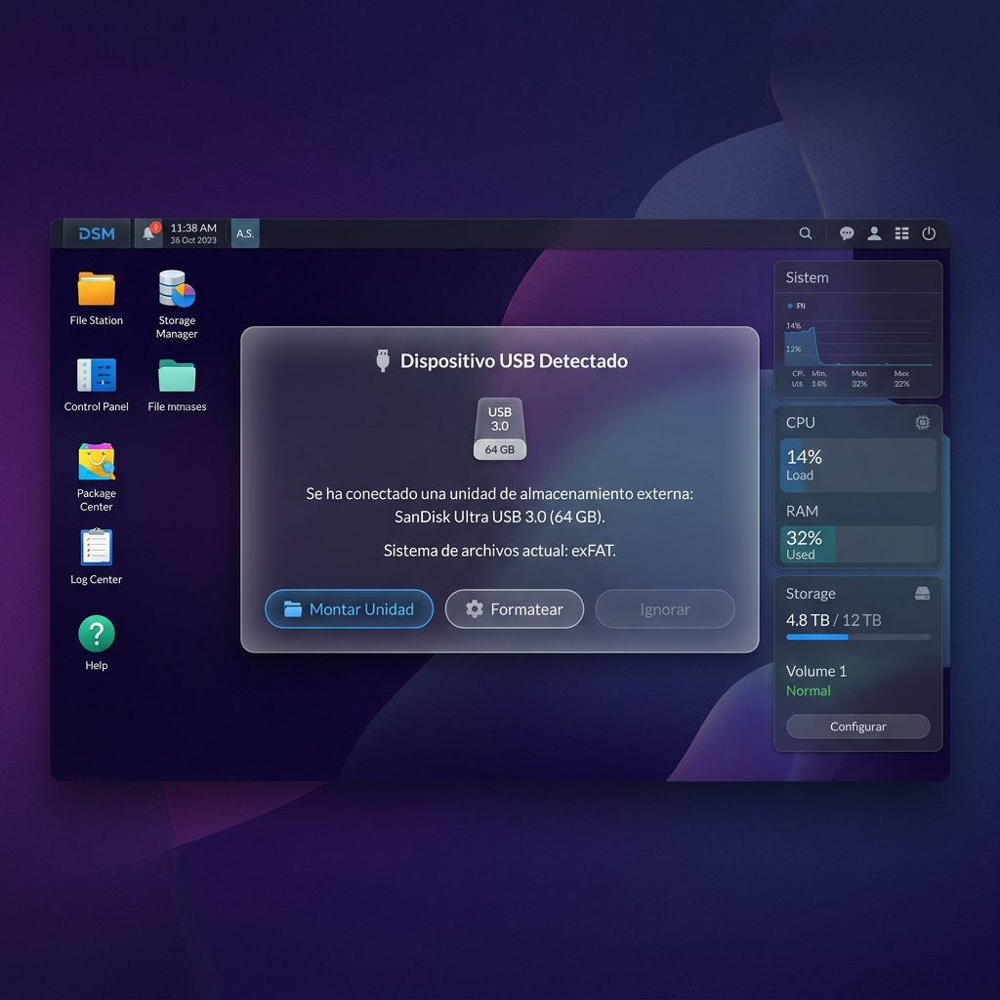
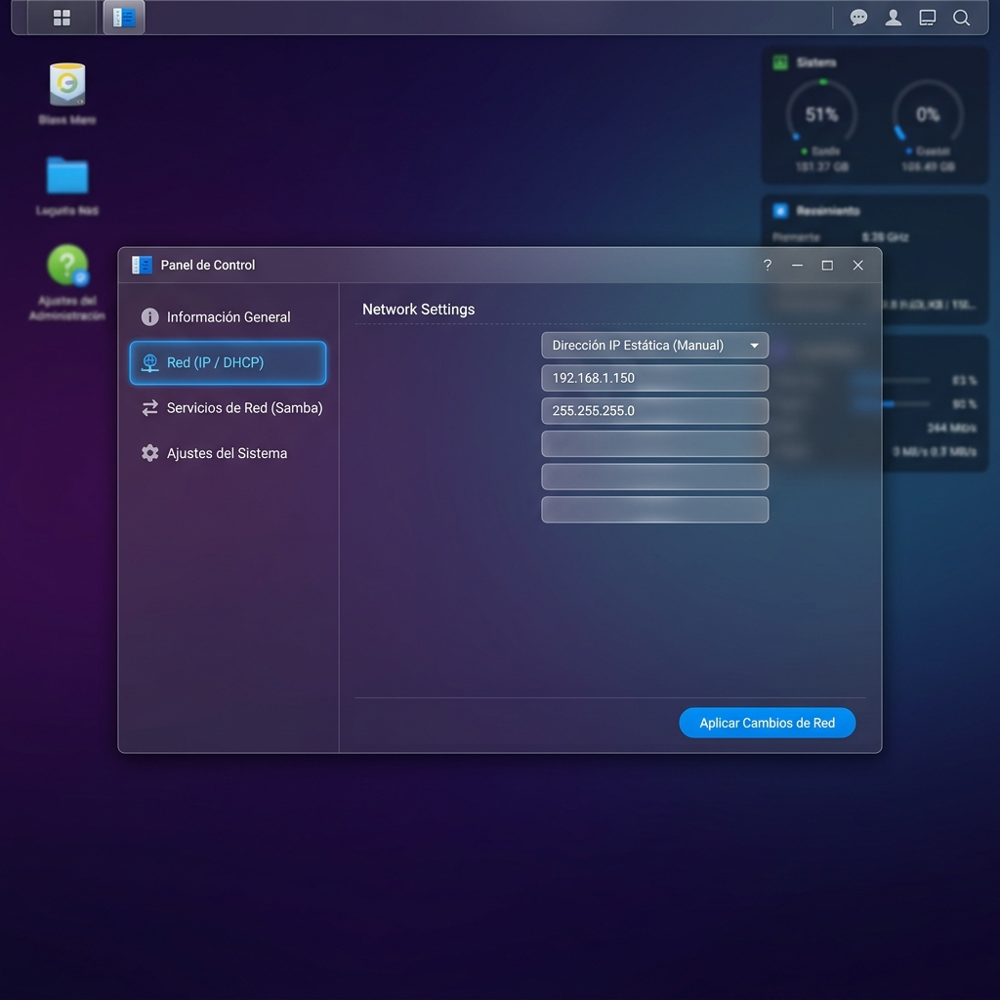

# 🚀 Synology DSM-style NAS Admin Panel for Debian & Ubuntu Server

Este proyecto es un panel de administración web premium e interactivo con estilo **Synology DiskStation Manager (DSM 7.2)** diseñado específicamente para correr sobre servidores Linux minimalistas, siendo 100% compatible y certificado para **Debian 12 / 13 (Trixie)** y **Ubuntu Server (20.04, 22.04 y 24.04 LTS)**.

Combina una interfaz frontend espectacular de tipo escritorio web (frosted glass/glassmorphism con HTML5/CSS3/Vanilla JS) con un backend ligero en Node.js que ejecuta comandos reales del sistema operativo para monitorizar y controlar tu servidor.

---

## 📸 Capturas de Pantalla (ZenithNAS OS)

Aquí puedes ver la interfaz premium con efecto **Glassmorphic** de ZenithNAS OS en acción:

| **Escritorio Web & Widgets** | **Download Station** |
|:---:|:---:|
|  |  |
| **Detección USB en Caliente** | **Panel de Control (Configuración de Red)** |
|  |  |

---

## 🌟 Características Integradas
1.  **Escritorio Web Completo**: Ventanas arrastrables, redimensionables, colapsables, barra de tareas superior activa, menú de aplicaciones (Launchpad), reloj en tiempo real y centro de notificaciones.
2.  **Monitor de Recursos (Resource Monitor)**: Gráficos de líneas interactivos en tiempo real creados con Canvas para CPU y RAM, lecturas de temperatura y rendimiento por núcleos.
3.  **File Station**: Navegador y gestor de archivos seguro (con aislamiento para evitar Directory Traversal). Permite listar carpetas, borrar elementos, crear carpetas y crear/escribir archivos reales.
4.  **Centro de Paquetes (Docker App Store)**: Un catálogo de un solo clic para instalar y controlar contenedores Docker populares (Jellyfin, qBittorrent, Nextcloud, Portainer, VS Code, Pi-hole). Cuenta con barra de carga visual y comunicación real con la API Docker del servidor.
5.  **Download Station (Gestor de Descargas)**: Soporta descargas directas reales por HTTP/HTTPS directamente a la carpeta `/shares/Descargas` midiendo velocidad y progreso, y simula la descarga de Torrents.
6.  **Panel de Control**: Sección con información de hardware del servidor, distribución OS y versión de Kernel real de Linux.
7.  **Widgets Laterales**: Indicadores directos en el escritorio de la salud general del sistema, Uptime acumulado y porcentaje de almacenamiento ocupado.

---

## 🛠️ Requisitos del Servidor (Debian / Ubuntu Server)

Para la experiencia completa de integración de producción, asegúrate de tener instalado en tu máquina Linux:
- **Node.js** (v18 o superior) y **npm**.
- **Docker** (para poder descargar e iniciar aplicaciones desde el Package Center).
- **Samba** (opcional, si deseas mapear la carpeta compartida en Windows/macOS).

---

## ⚙️ Instrucciones de Instalación y Despliegue en Debian / Ubuntu

Sigue estos sencillos pasos desde la terminal de tu servidor (funciona exactamente igual en Debian y Ubuntu):

### Paso 1: Instalar Dependencias de Linux (Servicios y Drivers de Disco)
Para asegurar que tu servidor reconozca discos externos formateados en **NTFS, exFAT y FAT32**, instalamos los controladores del núcleo junto con Node.js y Docker:

```bash
sudo apt update
sudo apt install -y nodejs npm docker.io ntfs-3g exfat-fuse exfatprogs dosfstools
```

Asegúrate de agregar tu usuario actual al grupo Docker para permitir que el backend controle contenedores sin permisos root:
```bash
sudo usermod -aG docker $USER
newgrp docker
```

### Paso 2: Clonar/Copiar esta carpeta al Servidor
Copia la carpeta completa `NAS` a tu servidor (por ejemplo, a `/opt/nas` o a tu carpeta home `/home/usuario/NAS`).

### Paso 3: Instalar Dependencias de Node.js
Entra en la carpeta del backend e instala las bibliotecas requeridas:
```bash
cd NAS/backend
npm install
```

### Paso 4: Iniciar el Servidor NAS
Inicia el servidor daemon en el puerto deseado (por defecto corren en el puerto 5000):
```bash
node server.js
```
El servidor backend iniciará y automáticamente servirá la espectacular interfaz web. Abre tu navegador y navega a:
👉 `http://IP_DE_TU_SERVIDOR:5000`

---

## 🖥️ Modo de Desarrollo (Ejecución en Windows)

Si deseas probar el prototipo localmente en Windows antes de subirlo a Ubuntu:
1. Asegúrate de tener instalado Node.js en Windows.
2. Abre la consola en `C:\Users\Admin\Desktop\NAS\backend`.
3. Ejecuta `npm install` para instalar dependencias.
4. Ejecuta `npm start` o `node server.js`.
5. Abre `http://localhost:5000` en tu navegador.
   - **Nota**: El backend detectará automáticamente que está corriendo en Windows y se ejecutará en **Modo de Simulación Elegante**, permitiéndote crear carpetas, borrar archivos y simular la instalación o detención de contenedores Docker con total funcionalidad visual y de base de datos simulada.

---

## 🛡️ Creación de Servicio de Autoinicio en Ubuntu (Systemd)

Para que tu panel estilo DSM se ejecute automáticamente en el arranque de Ubuntu 24.04:

1. Crea un archivo de servicio systemd:
   ```bash
   sudo nano /etc/systemd/system/nas-dsm.service
   ```

2. Pega el siguiente contenido (reemplaza `/home/usuario/NAS` con la ruta real y `usuario` con tu usuario de Ubuntu):
   ```ini
   [Unit]
   Description=NAS DSM-style Web Portal Service
   After=network.target docker.service

   [Service]
   Type=simple
   User=usuario
   WorkingDirectory=/home/usuario/NAS/backend
   ExecStart=/usr/bin/node server.js
   Restart=on-failure
   Environment=PORT=5000

   [Install]
   WantedBy=multi-user.target
   ```

3. Guarda el archivo, recarga systemd e inicia el servicio:
   ```bash
   sudo systemctl daemon-reload
   sudo systemctl enable nas-dsm.service
   sudo systemctl start nas-dsm.service
   ```

4. Verifica el estado:
   ```bash
   sudo systemctl status nas-dsm.service
   ```

---

## 📁 Carpeta de Datos Compartida
Por defecto, la carpeta donde File Station almacenará y creará todos tus datos compartidos es:
- En Ubuntu 24.04: `/srv/nas/shares/` (se crea automáticamente en la raíz con permisos).
- En Windows: `C:\Users\Admin\Desktop\NAS\shares\`

¡Puedes mapear esta ruta en tu red local utilizando Samba o NFS para compartir tus películas, fotos y descargas!

---

## 🔌 Soporte para Discos Externos (NTFS, exFAT, FAT32)

Tu panel DSM leerá y mostrará automáticamente cualquier disco externo montado en el sistema operativo bajo las rutas `/media/` o `/mnt/`.

### ¿Cómo montar discos externos manualmente en Debian/Ubuntu?
Para montar un disco externo para que el panel lo visualice y File Station pueda gestionar sus archivos:

1. **Identificar el disco** conectado (ej. `/dev/sdb1`):
   ```bash
   sudo fdisk -l
   ```
2. **Crear una carpeta de montaje** en `/media/` (ej. `/media/mi_disco`):
   ```bash
   sudo mkdir -p /media/mi_disco
   ```
3. **Montar la unidad** según su sistema de archivos:
   - **NTFS**: `sudo mount -t ntfs-3g /dev/sdb1 /media/mi_disco`
   - **exFAT**: `sudo mount -t exfat /dev/sdb1 /media/mi_disco`
   - **FAT32 (VFAT)**: `sudo mount -t vfat /dev/sdb1 /media/mi_disco`

¡Una vez montado, el disco aparecerá instantáneamente en el Monitor de Almacenamiento y en la lista de dispositivos de tu panel web!
